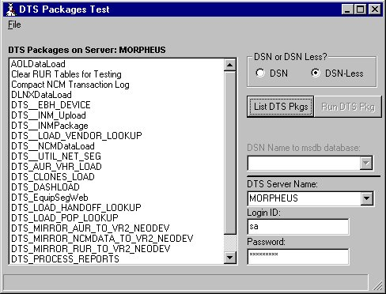

<div align="center">

## Run a SQL Server 7\.0 DTS Package from VB


</div>

### Description

UPDATED - 12/07/01!!! This kind of goes against my article earlier this this week. In a new environment I was able to do two things. I was able to query a list of DTS Packages from my Server and then execute a chosen Package remotely. This can be easily modified to accept collections and remotely fire multiple Packages on a timer (which is what I'm using it for). If you downloaded the zip file earlier you may want to download it again since I've updated it and revised some of the references.

NOTE: If you use a DSN connection it must be pointed at the MSDB database to get the list of DTS Packages, not the Database you are trying to run the DTS Packages Against.
 
### More Info
 


<span>             |<span>
---                |---
**Submitted On**   |2001-12-07 10:01:10
**By**             |[Chris Kesler](https://github.com/Planet-Source-Code/PSCIndex/blob/master/ByAuthor/chris-kesler.md)
**Level**          |Beginner
**User Rating**    |5.0 (30 globes from 6 users)
**Compatibility**  |VB 6\.0, VB Script, ASP \(Active Server Pages\) 
**Category**       |[Databases/ Data Access/ DAO/ ADO](https://github.com/Planet-Source-Code/PSCIndex/blob/master/ByCategory/databases-data-access-dao-ado__1-6.md)
**World**          |[Visual Basic](https://github.com/Planet-Source-Code/PSCIndex/blob/master/ByWorld/visual-basic.md)
**Archive File**   |[Run\_a\_SQL\_400771272001\.zip](https://github.com/Planet-Source-Code/chris-kesler-run-a-sql-server-7-0-dts-package-from-vb__1-29526/archive/master.zip)

### API Declarations

```
Public Declare Function ShellExecute& Lib "shell32.dll" Alias "ShellExecuteA" _
(ByVal hwnd As Long, ByVal lpOperation As String, ByVal lpFile As String, ByVal lpParameters As String, ByVal lpDirectory As String, ByVal nShowCmd As Long)
Public Const SW_NORMAL = 1
```


